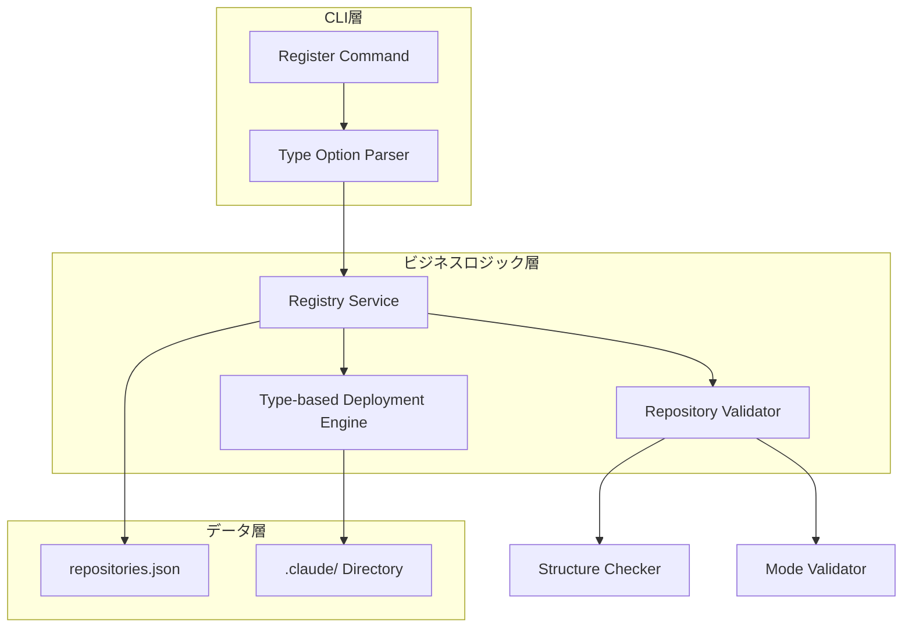
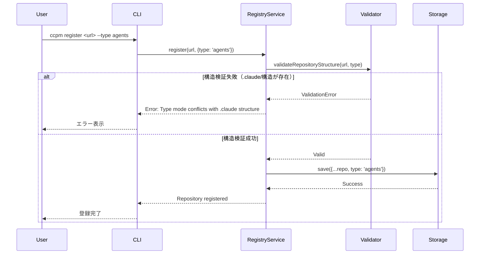
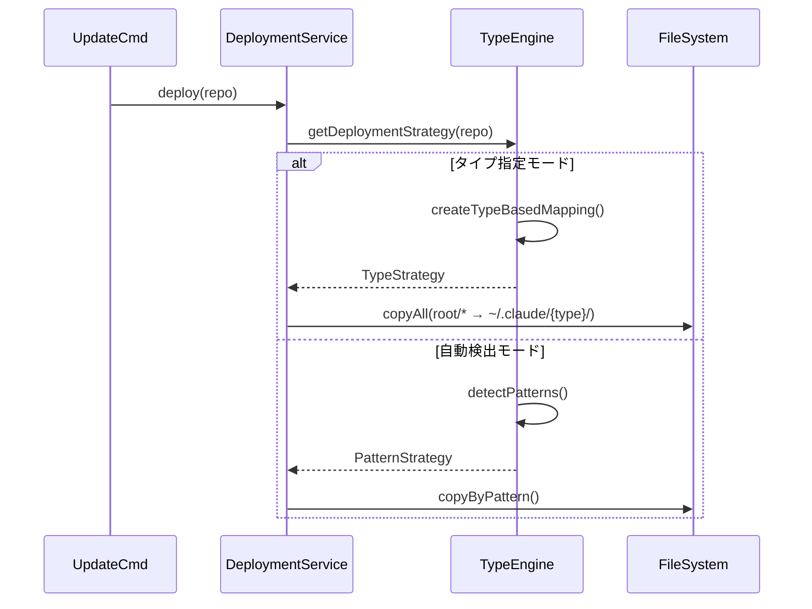
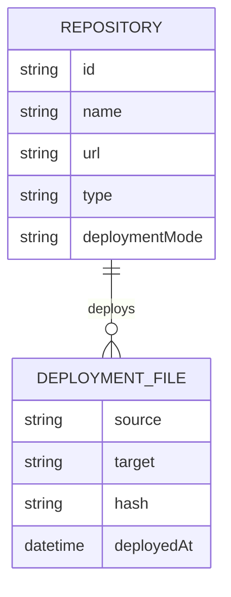
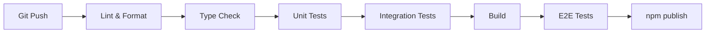

# 技術設計

## 概要
リポジトリ登録時にタイプを指定することで、リポジトリ直下のコンテンツを指定されたタイプのディレクトリに直接デプロイする機能を実装します。これにより、`.claude/`ディレクトリ構造を持たないシンプルなリポジトリでも、agents、commands、hooksなどのツールを容易に提供できるようになります。

## 要件マッピング

### 設計コンポーネントのトレーサビリティ
各設計コンポーネントが対応する要件：
- **リポジトリタイプ拡張** → 要件1: リポジトリ登録時のタイプ指定機能
- **タイプベースデプロイメントエンジン** → 要件2: タイプ別デプロイメントルール
- **構造検証モジュール** → 要件3: リポジトリ構造の検証
- **メタデータ管理** → 要件4: デプロイメント情報の記録と表示
- **互換性レイヤー** → 要件5: 後方互換性の維持

### ユーザーストーリーカバレッジ
- ツール管理者ストーリー: タイプ指定によるシンプルな登録フロー
- 開発者ストーリー: 柔軟なリポジトリ構造のサポート
- システム管理者ストーリー: 明確なモード分離と検証機能

## アーキテクチャ

### システム構成


### 技術スタック
既存のスタックを活用し、最小限の追加で実装：

- **CLI Framework**: Commander.js（既存）+ タイプオプション拡張
- **Validation**: 新規構造検証モジュール
- **Deployment**: 既存DeploymentServiceの拡張
- **Storage**: repositories.json（typeフィールド追加）

### アーキテクチャ決定の根拠
- **既存システムとの整合性**: 現在のモジュール構造を維持しつつ拡張
- **段階的移行**: 既存の自動検出モードと新しいタイプ指定モードの共存
- **シンプルな実装**: 複雑な抽象化を避け、明確なモード分離を実現

## データフロー

### リポジトリ登録フロー（タイプ指定あり）


### デプロイメントフロー（タイプベース）


## コンポーネントと インターフェース

### バックエンドサービス & メソッドシグネチャ

#### 拡張されたRepository型
```typescript
interface Repository {
  // 既存フィールド
  id: string;
  name: string;
  url: string;
  // ... 
  
  // 新規フィールド
  type?: 'agents' | 'commands' | 'hooks';  // リポジトリタイプ
  deploymentMode?: 'type-based' | 'auto-detect';  // デプロイメントモード
}
```

#### RegistryService拡張
```typescript
class RegistryService {
  // 既存メソッド
  async register(url: string): Promise<Repository>;
  
  // 拡張メソッド
  async registerWithType(url: string, type: RepositoryType): Promise<Repository>;
  private async validateTypeMode(repoPath: string, type: RepositoryType): Promise<void>;
}
```

#### 新規: RepositoryValidator
```typescript
class RepositoryValidator {
  async validateStructure(repoPath: string, type?: RepositoryType): Promise<ValidationResult>;
  private hasClaudeStructure(repoPath: string): Promise<boolean>;
  private hasTypeDirectories(repoPath: string): Promise<boolean>;
  private hasMdFiles(repoPath: string): Promise<boolean>;
}
```

#### DeploymentService拡張
```typescript
class DeploymentService {
  // 既存メソッド
  async deploy(repo: Repository, options?: DeployOptions): Promise<DeploymentResult>;
  
  // 新規メソッド
  async deployTypeMode(repo: Repository): Promise<DeploymentResult>;
  private getTypeBasedPatterns(type: RepositoryType): string[];
  private mapRootToType(files: string[], type: RepositoryType): PatternMatch[];
}
```

### CLIコマンド拡張

| コマンド | 説明 | 新規/変更 |
|---------|------|----------|
| `register <url> --type <type>` | タイプを指定してリポジトリを登録 | 拡張 |
| `list` | リポジトリ一覧（タイプ情報含む） | 拡張 |
| `list --verbose` | 詳細表示（デプロイメントマッピング） | 拡張 |
| `status` | ステータス表示（タイプ別集計） | 拡張 |

### APIエンドポイント
（CLIツールのため、外部APIエンドポイントは不要）

## データモデル

### ドメインエンティティ
1. **Repository**: リポジトリ情報（typeフィールド追加）
2. **DeploymentMapping**: デプロイメントマッピング情報
3. **ValidationResult**: 構造検証結果

### エンティティ関係


### データモデル定義

#### TypeScript型定義
```typescript
// リポジトリタイプ
type RepositoryType = 'agents' | 'commands' | 'hooks';

// デプロイメントモード
type DeploymentMode = 'type-based' | 'auto-detect';

// 検証結果
interface ValidationResult {
  isValid: boolean;
  errors: ValidationError[];
  warnings: string[];
  detectedStructures: {
    hasClaudeDir: boolean;
    hasTypeDirectories: string[];
    hasMdFiles: boolean;
  };
}

// 検証エラー
interface ValidationError {
  code: 'STRUCTURE_CONFLICT' | 'NO_DEPLOYABLE_FILES' | 'INVALID_TYPE';
  message: string;
  suggestion: string;
}
```

### データベーススキーマ
repositories.jsonの構造：
```json
{
  "version": "2.0.0",
  "repositories": [
    {
      "id": "hash-id",
      "name": "repo-name",
      "url": "https://github.com/...",
      "type": "agents",
      "deploymentMode": "type-based",
      "registeredAt": "2025-01-31T00:00:00Z",
      "deployments": {
        "agents": ["file1.md", "subdir/file2.md"]
      }
    }
  ]
}
```

### マイグレーション戦略
- バージョン1.x → 2.0の自動マイグレーション
- typeフィールドがない場合はnullとして扱い、自動検出モードを使用
- 既存のdeploymentsフィールドはそのまま保持

## エラーハンドリング

### エラー種別と対処
| エラー種別 | エラーコード | 対処方法 |
|-----------|-------------|----------|
| 構造競合 | STRUCTURE_CONFLICT | タイプ指定を外すか、.claude/構造を削除 |
| デプロイ可能ファイルなし | NO_DEPLOYABLE_FILES | --forceで強制登録、または構造確認 |
| 無効なタイプ | INVALID_TYPE | 有効なタイプ一覧を表示 |
| 既存リポジトリ | DUPLICATE_REPO | 既存登録の情報を表示 |

### エラーメッセージ例
```typescript
const errorMessages = {
  STRUCTURE_CONFLICT: `
    Error: Type-based deployment conflicts with existing structure
    
    The repository contains .claude/ directory or type-specific directories,
    which is not allowed when using --type option.
    
    Solutions:
    1. Remove --type option to use auto-detection mode
    2. Remove .claude/ directory from the repository
    3. Use a different repository structure
  `,
  NO_DEPLOYABLE_FILES: `
    Warning: No deployable files found in repository root
    
    The repository doesn't contain any .md files in the root directory.
    
    Continue anyway? [y/N]
  `
};
```

## セキュリティ考慮事項

### 入力検証
- URLフォーマットの厳密な検証（既存）
- タイプ値のホワイトリスト検証
- ファイルパスのサニタイゼーション（既存）

### ファイルシステムセキュリティ
- シンボリックリンクの追跡を無効化
- `.claude/`ディレクトリ外への書き込み防止（既存）
- ファイル権限の保持（既存）

### リポジトリ検証
- 悪意のあるファイル名のチェック
- 巨大ファイルの検出と警告
- バイナリファイルの除外

## パフォーマンスと スケーラビリティ

### パフォーマンス目標
| メトリクス | 目標値 | 測定方法 |
|-----------|--------|----------|
| リポジトリ登録時間 | < 2秒 | URL検証〜保存完了 |
| 構造検証時間 | < 500ms | ローカルリポジトリ検証 |
| デプロイメント時間 | < 10秒/100ファイル | ファイルコピー完了 |
| メモリ使用量 | < 100MB | プロセス全体 |

### 最適化戦略
- ファイル検証の並列処理
- glob パターンのキャッシング
- 増分デプロイメント（変更ファイルのみ）

## テスト戦略

### テストカバレッジ要件
- **ユニットテスト**: ≥90%（新規コード）
- **統合テスト**: 全デプロイメントシナリオ
- **E2Eテスト**: タイプ指定フローの完全テスト

### テストシナリオ

#### ユニットテスト
```typescript
describe('RepositoryValidator', () => {
  it('should detect .claude structure', async () => {});
  it('should validate type mode requirements', async () => {});
  it('should handle empty repositories', async () => {});
});

describe('TypeBasedDeployment', () => {
  it('should map root files to type directory', async () => {});
  it('should preserve directory structure', async () => {});
  it('should skip README.md', async () => {});
});
```

#### 統合テスト
1. タイプ指定での登録→更新→デプロイフロー
2. 構造検証エラーのハンドリング
3. 既存リポジトリとの互換性
4. モード切り替えシナリオ

#### E2Eテスト
```bash
# タイプ指定登録
ccpm register https://github.com/example/agents-repo --type agents
ccpm update agents-repo
ccpm list --verbose

# 構造競合検出
ccpm register https://github.com/example/claude-repo --type commands
# → エラー: .claude/構造が検出されました

# 自動検出モード（後方互換）
ccpm register https://github.com/example/claude-repo
ccpm update claude-repo
```

### CI/CDパイプライン
