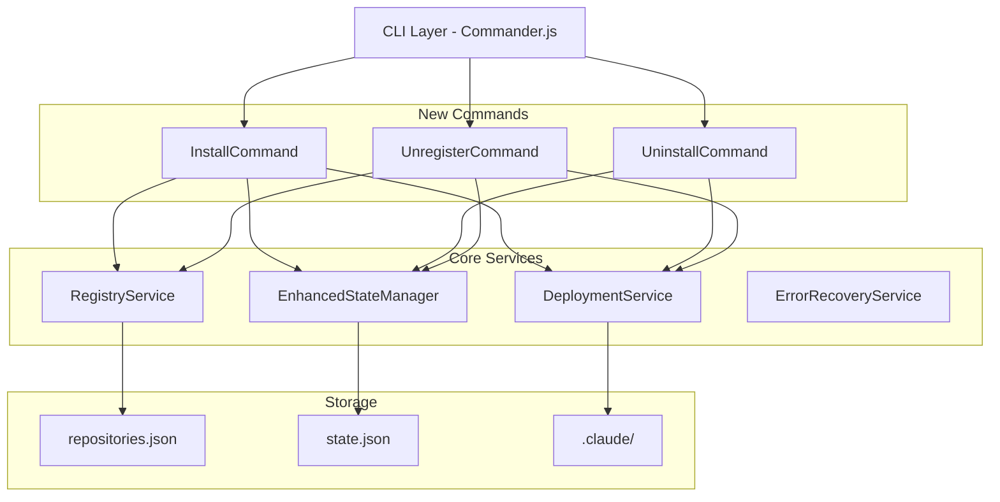
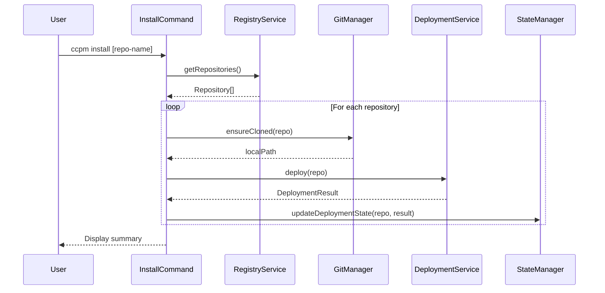
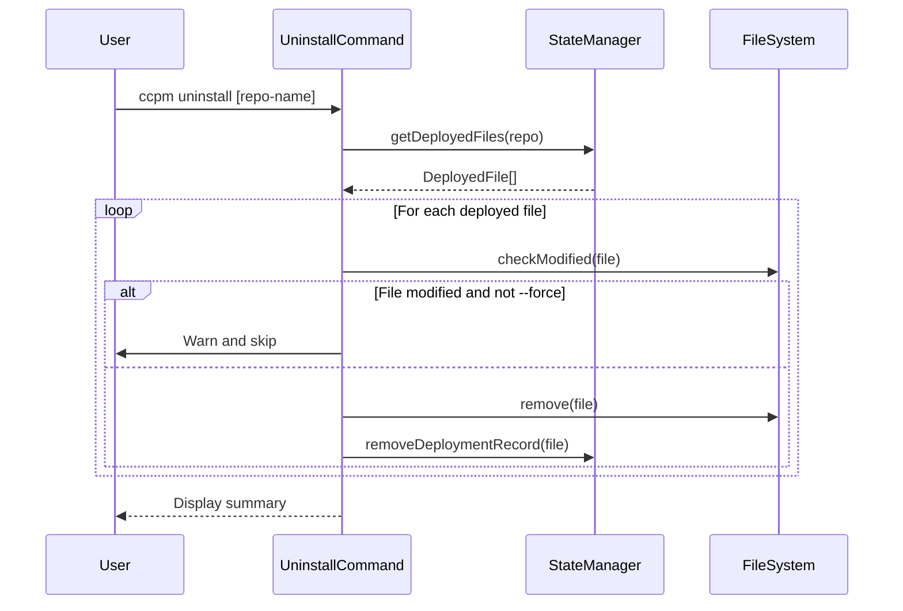
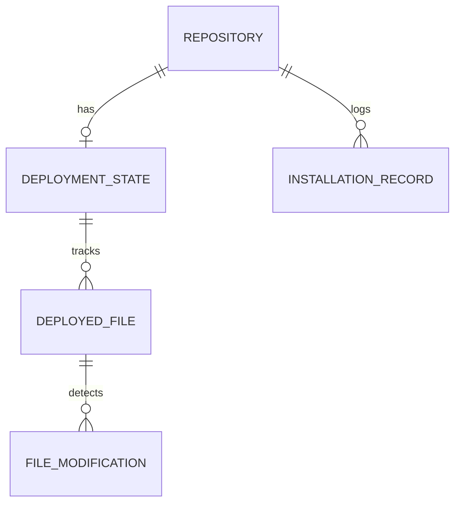
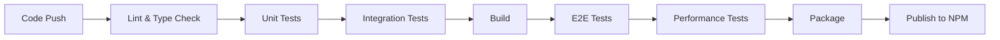

# Technical Design

## Overview

This design implements a restructured command system that separates repository registration management from file deployment management. The new structure provides clearer semantics and better user control through dedicated command pairs: `register`/`unregister` for repository management and `install`/`uninstall` for file deployment management.

## Requirements Mapping

### Design Component Traceability
Each design component addresses specific requirements:
- **InstallCommand** → REQ-1: Install command for deploying registered repositories
- **UninstallCommand** → REQ-2: Uninstall command for removing deployed files
- **UnregisterCommand** → REQ-3: Unregister command for complete repository removal
- **EnhancedStateManager** → REQ-4: State management and tracking
- **ErrorRecoveryService** → REQ-5: Error handling and recovery
- **CommandOutputFormatter** → REQ-6: User experience and clear output
- **MigrationHandler** → REQ-7: Command migration from remove to unregister

### User Story Coverage
- **Developer deployment story**: InstallCommand with batch and selective deployment
- **Environment cleanup story**: UninstallCommand preserving registrations
- **Complete removal story**: UnregisterCommand with optional file preservation
- **Administrator tracking story**: EnhancedStateManager with detailed deployment records
- **Error recovery story**: ErrorRecoveryService with rollback capabilities
- **User experience story**: CommandOutputFormatter with consistent output patterns
- **Migration story**: MigrationHandler with deprecation notices

## Architecture

The design extends the existing architecture while maintaining backward compatibility and adding new capabilities for separated command responsibilities.



### Technology Stack
Based on research and existing codebase analysis:

- **CLI Framework**: Commander.js (existing)
- **Language**: TypeScript 5.x with strict mode
- **File Operations**: fs-extra for atomic operations
- **State Management**: JSON with atomic writes and backups
- **Progress Indicators**: ora for spinners
- **User Prompts**: inquirer for confirmations
- **Error Handling**: Custom error classes with recovery strategies
- **Testing**: Jest with integration test focus

### Architecture Decision Rationale

- **Why separate commands**: Clear separation of concerns - registration is about tracking repositories, installation is about deploying files
- **Why preserve existing services**: Minimize changes to stable code, extend rather than replace
- **Why enhanced state management**: Need to track deployment status separately from registration status
- **Why atomic operations**: Prevent partial states during failures
- **Why migration handler**: Smooth transition for existing users without breaking changes

## Data Flow

### Install Command Flow
Primary flow for deploying files from registered repositories:



### Uninstall Command Flow
Flow for removing deployed files while preserving registrations:



## Components and Interfaces

### Backend Services & Method Signatures

#### InstallCommand
```typescript
class InstallCommand {
  constructor(
    private registryService: IRegistryService,
    private deploymentService: IDeploymentService,
    private stateManager: IStateManager,
    private gitManager: IGitManager
  ) {}
  
  async execute(repositoryName?: string, options: InstallOptions): Promise<void>
  private async installRepository(repo: Repository, options: InstallOptions): Promise<InstallResult>
  private async ensureCloned(repo: Repository): Promise<string>
  private displayProgress(current: number, total: number, repoName: string): void
  private displaySummary(results: InstallResult[]): void
}

interface InstallOptions {
  force?: boolean;      // Overwrite without prompting
  dryRun?: boolean;     // Preview changes
  silent?: boolean;     // Suppress output
  verbose?: boolean;    // Detailed output
  json?: boolean;       // JSON output format
}
```

#### UninstallCommand
```typescript
class UninstallCommand {
  constructor(
    private stateManager: IStateManager,
    private fileSystem: IFileSystem
  ) {}
  
  async execute(repositoryName?: string, options: UninstallOptions): Promise<void>
  private async uninstallRepository(repo: Repository, options: UninstallOptions): Promise<UninstallResult>
  private async checkFileModified(filePath: string, originalHash: string): Promise<boolean>
  private async removeDeployedFile(file: DeployedFile, options: UninstallOptions): Promise<void>
}

interface UninstallOptions {
  force?: boolean;      // Remove modified files
  dryRun?: boolean;     // Preview removals
  silent?: boolean;     // Suppress output
  verbose?: boolean;    // Detailed output
  json?: boolean;       // JSON output format
}
```

#### UnregisterCommand
```typescript
class UnregisterCommand {
  constructor(
    private registryService: IRegistryService,
    private stateManager: IStateManager,
    private uninstallCommand: UninstallCommand
  ) {}
  
  async execute(repositoryName: string, options: UnregisterOptions): Promise<void>
  private async confirmRemoval(repo: Repository, hasDeployedFiles: boolean): Promise<boolean>
  private async removeRepository(repo: Repository, options: UnregisterOptions): Promise<void>
}

interface UnregisterOptions {
  keepFiles?: boolean;  // Keep deployed files
  force?: boolean;      // Skip confirmation
  dryRun?: boolean;     // Preview removal
}
```

#### EnhancedStateManager
```typescript
interface IEnhancedStateManager extends IStateManager {
  // New methods for separated state tracking
  getDeploymentState(repoId: string): Promise<DeploymentState>
  updateDeploymentState(repoId: string, state: DeploymentState): Promise<void>
  getDeployedFiles(repoId?: string): Promise<DeployedFile[]>
  removeDeploymentRecords(repoId: string, files?: string[]): Promise<void>
  reconstructState(): Promise<void>  // For corrupted state recovery
}

interface DeploymentState {
  repositoryId: string;
  lastInstalled?: string;    // ISO 8601
  lastUninstalled?: string;  // ISO 8601
  deployedFiles: DeployedFile[];
  installationStatus: 'installed' | 'partial' | 'uninstalled';
}
```

### Frontend Components
Command-line interface components:

| Component Name | Responsibility | Props/State Summary |
|----------------|----------------|---------------------|
| ProgressIndicator | Show installation/uninstallation progress | current, total, message |
| SummaryDisplay | Display operation results | stats, duration, errors |
| ConflictPrompt | Handle file conflicts interactively | file, strategy, onResolve |
| DeprecationNotice | Show migration guidance | oldCommand, newCommand, docs |

### API Endpoints
Not applicable for CLI tool, but command interfaces serve similar purpose:

| Command | Syntax | Purpose | Options | Exit Codes |
|---------|--------|---------|---------|------------|
| install | `ccpm install [repo]` | Deploy repository files | --force, --dry-run, --silent, --verbose, --json | 0, 1, 2 |
| uninstall | `ccpm uninstall [repo]` | Remove deployed files | --force, --dry-run, --silent, --verbose, --json | 0, 1, 2 |
| unregister | `ccpm unregister <repo>` | Remove repository completely | --keep-files, --force, --dry-run | 0, 1, 2 |

## Data Models

### Domain Entities
1. **Repository**: Existing entity for registered repositories
2. **DeploymentState**: New entity for tracking installation status
3. **DeployedFile**: Enhanced entity with modification tracking
4. **InstallationRecord**: Audit trail for install/uninstall operations

### Entity Relationships


### Data Model Definitions

```typescript
// Enhanced Repository interface
interface Repository {
  id: string;
  name: string;
  url: string;
  registeredAt: string;
  lastUpdatedAt?: string;
  localPath?: string;
  deployments: RepositoryDeployments;
  type?: RepositoryType;
  deploymentMode?: DeploymentMode;
  status: RepositoryStatus;
  // New field
  installationStatus?: 'installed' | 'partial' | 'uninstalled';
}

// New DeploymentState interface
interface DeploymentState {
  repositoryId: string;
  lastInstalled?: string;
  lastUninstalled?: string;
  deployedFiles: DeployedFile[];
  installationStatus: 'installed' | 'partial' | 'uninstalled';
  version?: string;  // Track deployed version
}

// Enhanced DeployedFile interface
interface DeployedFile {
  source: string;
  target: string;
  hash: string;
  deployedAt: string;
  // New fields
  originalHash: string;      // For modification detection
  isModified?: boolean;      // Cached modification status
  lastChecked?: string;      // When modification was last checked
}

// New InstallationRecord for audit trail
interface InstallationRecord {
  id: string;
  repositoryId: string;
  operation: 'install' | 'uninstall' | 'unregister';
  timestamp: string;
  filesAffected: number;
  success: boolean;
  error?: string;
  options?: Record<string, any>;
}
```

### Database Schema
Using JSON file storage (consistent with existing approach):

```typescript
// state.json structure
{
  "version": "2.0.0",  // Bumped for new structure
  "repositories": {
    "[repoId]": {
      "lastSync": "ISO 8601",
      "lastCommit": "SHA",
      "deploymentState": {
        "lastInstalled": "ISO 8601",
        "lastUninstalled": "ISO 8601",
        "installationStatus": "installed|partial|uninstalled",
        "deployedFiles": [...]
      }
    }
  },
  "installationHistory": [...],  // New audit trail
  "metadata": {
    "lastCleanup": "ISO 8601",
    "createdAt": "ISO 8601",
    "updatedAt": "ISO 8601"
  }
}
```

### Migration Strategy
- Automatic migration from v1 to v2 state format
- Preserve existing deployment records
- Add installationStatus based on deployedFiles presence
- Create backup before migration
- Rollback capability if migration fails

## Error Handling

Comprehensive error handling with recovery strategies:

```typescript
// Custom error classes
class InstallationError extends Error {
  constructor(
    message: string,
    public code: string,
    public repository?: string,
    public recoverable: boolean = true
  ) {
    super(message);
  }
}

class StateCorruptionError extends Error {
  constructor(
    message: string,
    public stateFile: string,
    public backup?: string
  ) {
    super(message);
  }
}

// Error recovery strategies
class ErrorRecoveryService {
  async handleInstallError(error: InstallationError): Promise<void> {
    switch (error.code) {
      case 'REPO_NOT_FOUND':
        // Suggest registration
        break;
      case 'CLONE_FAILED':
        // Retry with different method
        break;
      case 'DEPLOY_CONFLICT':
        // Prompt for resolution
        break;
      case 'STATE_CORRUPT':
        // Attempt reconstruction
        break;
    }
  }
}
```

## Security Considerations

### Authentication & Authorization
- Leverage existing SSH/HTTPS git authentication
- No additional auth needed for local operations
- File permissions preserved during deployment

### Data Protection
- State file backups before modifications
- Atomic write operations to prevent corruption
- Hash verification for deployed files
- No sensitive data in state files

### Security Best Practices
- Validate repository URLs before cloning
- Sanitize file paths to prevent directory traversal
- Check file permissions before removal
- Warn about modified files before removal
- Audit trail for all operations

## Performance & Scalability

### Performance Targets
| Metric | Target | Measurement |
|--------|--------|-------------|
| Install time (single repo) | < 5s | Excluding git clone |
| Uninstall time (100 files) | < 2s | File removal only |
| State file operations | < 100ms | Read/write cycle |
| Startup time | < 500ms | Command initialization |
| Memory usage | < 100MB | Peak during operation |

### Caching Strategy
- **Git operations**: Use existing clones when possible
- **File hashes**: Cache for modification detection
- **State snapshots**: In-memory during operations
- **Pattern matching**: Cache glob results

### Scalability Approach
- Parallel repository processing for batch operations
- Streaming file operations for large deployments
- Incremental state updates
- Lazy loading of repository data

## Testing Strategy

### Test Coverage Requirements
- **Unit Tests**: ≥85% code coverage for new commands
- **Integration Tests**: All command combinations
- **E2E Tests**: Complete install/uninstall workflows
- **Migration Tests**: Backward compatibility verification

### Testing Approach

1. **Unit Testing**
   ```typescript
   describe('InstallCommand', () => {
     it('should deploy files from all registered repositories');
     it('should handle missing repositories gracefully');
     it('should respect --force flag for conflicts');
     it('should skip already deployed files');
   });
   ```

2. **Integration Testing**
   ```typescript
   describe('Install/Uninstall Integration', () => {
     it('should maintain consistent state across operations');
     it('should handle concurrent commands safely');
     it('should recover from interrupted operations');
   });
   ```

3. **End-to-End Testing**
   ```typescript
   describe('Complete Workflow', () => {
     it('register -> install -> uninstall -> unregister');
     it('migration from remove to unregister');
     it('error recovery scenarios');
   });
   ```

4. **Performance Testing**
   - Benchmark large repository deployments
   - Stress test with many small files
   - Memory profiling during operations

### CI/CD Pipeline
