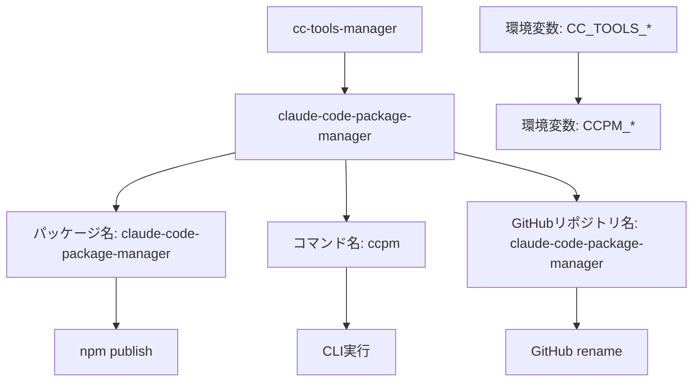
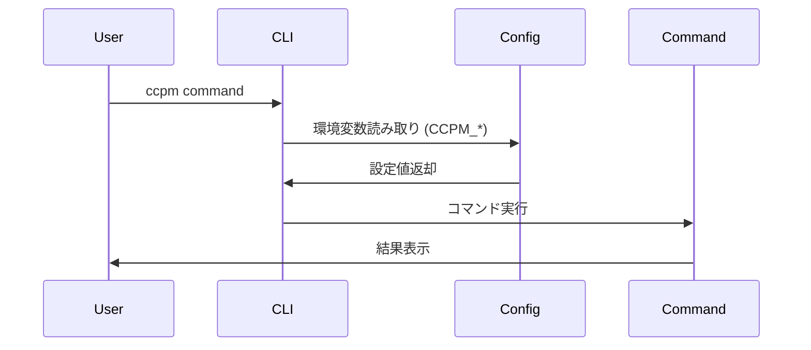

# 技術設計書

## 概要

このドキュメントは、cc-tools-managerからclaude-code-package-manager（コマンド名: ccpm）への名前変更に関する技術設計を定義します。まだリリースされていないプロジェクトのため、後方互換性を考慮せずクリーンな実装を行います。

## 要件マッピング

### 設計コンポーネントのトレーサビリティ
各設計コンポーネントが対応する要件：
- **名前選定戦略** → 要件1: プロジェクト名の選定と変更
- **package.json更新設計** → 要件2: npmパッケージの設定更新
- **ソースコード更新設計** → 要件3: ソースコード内の参照更新
- **ドキュメント更新設計** → 要件4: ドキュメントの更新
- **GitHubリポジトリ名変更** → 要件6: GitHubリポジトリの移行
- **ビルド・テスト更新設計** → 要件7: テストとビルドシステムの更新

### ユーザーストーリーカバレッジ
- プロジェクトメンテナー: 名前選定戦略とGitHubリポジトリ名変更で対応
- 開発者: package.json更新、ソースコード更新、ビルド・テスト更新で対応
- 新規ユーザー: ドキュメント更新設計で対応

## アーキテクチャ

### 名前変更の全体構成



### 技術スタック
既存のスタックを維持：
- **言語**: TypeScript/JavaScript
- **ランタイム**: Node.js 18+
- **パッケージマネージャー**: npm
- **CLI フレームワーク**: Commander.js
- **ビルドツール**: TypeScript Compiler
- **テストフレームワーク**: Jest

### アーキテクチャ決定の根拠
- **claude-code-package-manager**: npmでの一意性、Claude関連であることの明確性
- **ccpm**: 4文字で覚えやすく、タイピングしやすい
- **クリーンな実装**: 未リリースのため、レガシーコードなしで実装可能

## データフロー

### コマンド実行フロー



## コンポーネントと インターフェース

### 更新対象ファイル一覧

| ファイルパス | 更新内容 | 要件 |
|------------|---------|------|
| package.json | name, bin, repository, bugs, homepage | 要件2 |
| src/cli.ts | program.name('ccpm') | 要件3 |
| src/constants/paths.ts | 環境変数プレフィックス | 要件3 |
| src/utils/logger.ts | アプリケーション名 | 要件3 |
| README.md | 全般的な名前更新 | 要件4 |
| install.sh | リポジトリURL | 要件6 |
| tests/**/*.test.ts | 名前参照 | 要件7 |

### 環境変数マッピング

| 新環境変数 | デフォルト値 | 説明 |
|-----------|------------|------|
| CCPM_HOME | ~/.ccpm | ツール保存用ベースディレクトリ |
| CCPM_CLAUDE_DIR | ~/.claude | Claudeディレクトリ |
| CCPM_LOG_LEVEL | INFO | ログレベル |
| CCPM_CONFIG | (なし) | カスタム設定ファイルパス |
| CCPM_NO_COLOR | (なし) | カラー出力無効化 |
| CCPM_DRY_RUN | (なし) | ドライラン実行 |
| CCPM_FORCE | (なし) | 確認スキップ |
| CCPM_PARALLEL | (なし) | 並列処理有効化 |

## データモデル

### パッケージメタデータ

```typescript
interface PackageMetadata {
  name: 'claude-code-package-manager';
  displayName: 'Claude Code Package Manager';
  commandName: 'ccpm';
  version: string; // 0.1.0 から開始
  description: string;
  author: string;
  license: string;
}
```

### 設定構造

```typescript
interface CCPMConfig {
  version: string;
  repositories: Repository[];
  settings: {
    autoUpdate: boolean;
    parallelOperations: boolean;
    conflictResolution: 'skip' | 'overwrite' | 'prompt';
  };
  mappings: {
    [repoName: string]: {
      source: string;
      target: string;
    }[];
  };
}
```

## エラーハンドリング

### 標準エラー処理

```typescript
export class CCPMError extends Error {
  constructor(message: string, public code: string) {
    super(message);
    this.name = 'CCPMError';
  }
}

// エラーコード
export const ErrorCodes = {
  INVALID_COMMAND: 'INVALID_COMMAND',
  REPOSITORY_NOT_FOUND: 'REPOSITORY_NOT_FOUND',
  GIT_ERROR: 'GIT_ERROR',
  FILE_PERMISSION_ERROR: 'FILE_PERMISSION_ERROR'
};
```

## セキュリティ考慮事項

### 標準的なセキュリティ対策
- 環境変数の値は暗号化されていない前提で扱う
- GitHubトークンなどの機密情報は環境変数で管理
- ファイルパーミッションの保持

## パフォーマンスとスケーラビリティ

### パフォーマンス目標
| メトリクス | 目標 | 測定方法 |
|-----------|------|---------|
| 起動時間 | < 100ms | CLI起動から初期表示まで |
| リポジトリ更新 | < 5s/repo | 単一リポジトリの更新時間 |
| ファイルデプロイ | < 1s | 100ファイルのデプロイ |

## テスト戦略

### テストカバレッジ要件
- **単体テスト**: コア機能の80%以上のカバレッジ
- **統合テスト**: CLIコマンドの実行テスト
- **E2Eテスト**: 主要なユーザーシナリオ

### テストケース

1. **環境変数テスト**
   ```typescript
   describe('Environment Variables', () => {
     it('CCPM_HOME環境変数を正しく読み取る', () => {});
     it('デフォルト値を使用する', () => {});
   });
   ```

2. **コマンド実行テスト**
   ```typescript
   describe('CLI', () => {
     it('ccpmコマンドで正常に起動', () => {});
     it('npx claude-code-package-managerで実行可能', () => {});
     it('各サブコマンドが正常に動作', () => {});
   });
   ```

3. **名前変更検証テスト**
   ```typescript
   describe('Name Change Validation', () => {
     it('すべてのファイルで新しい名前を使用', () => {});
     it('旧名の参照が残っていない', () => {});
   });
   ```

## 実装手順

### 一括実装アプローチ
後方互換性を考慮する必要がないため、すべての変更を一度に実施：

1. **package.json の更新**
   - name: "claude-code-package-manager"
   - bin: { "ccpm": "./dist/index.js" }
   - repository, bugs, homepage のURL更新

2. **ソースコード内の名前変更**
   - CLI名: program.name('ccpm')
   - 環境変数プレフィックス: CC_TOOLS_* → CCPM_*
   - ログメッセージとエラーメッセージ内の名前
   - 定数ファイル内の参照

3. **ドキュメントの更新**
   - README.md の全面改訂
   - CONTRIBUTING.md の更新
   - docs/ 配下のファイル
   - .kiro/steering/ の関連ファイル

4. **テストの更新**
   - テストファイル内の名前参照
   - 環境変数名の変更
   - 期待値の更新

5. **その他の更新**
   - install.sh のリポジトリURL
   - TypeScript設定（必要に応じて）
   - GitHubリポジトリ名の変更