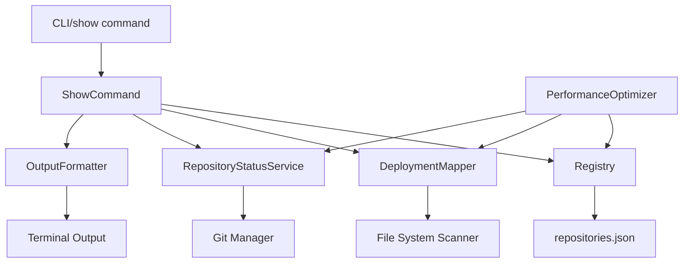
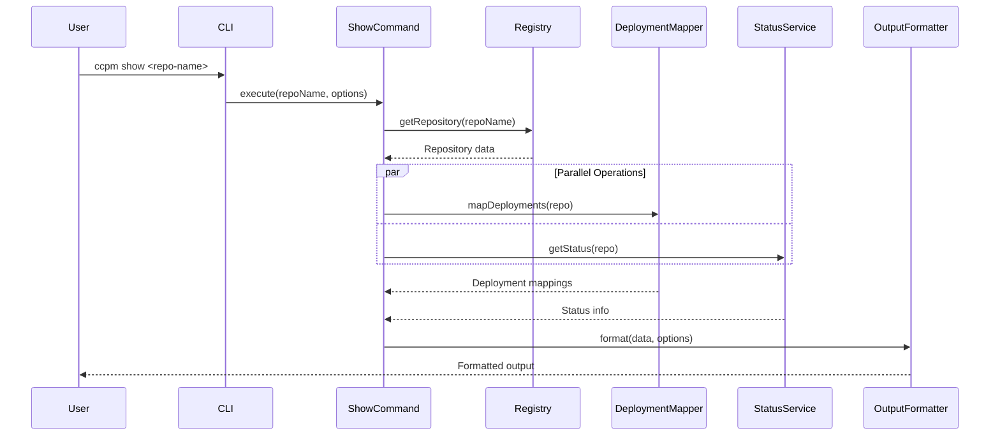
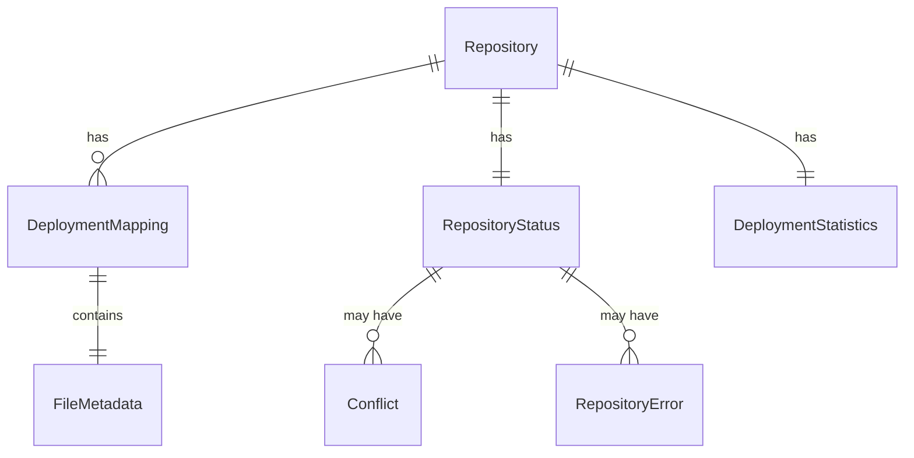
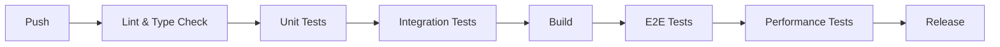

# Technical Design

## Overview
本設計は、cc-tools-managerに`show`コマンドを追加し、リポジトリの詳細情報、特にファイルのデプロイメント情報（from-to）を視覚的に分かりやすく表示する機能を実装します。既存のアーキテクチャとの整合性を保ちながら、高いパフォーマンスとユーザビリティを実現します。

## Requirements Mapping

### Design Component Traceability
各設計コンポーネントが対応する要件：
- **ShowCommand** → REQ-1.1, REQ-1.2, REQ-1.3: showコマンドの基本実装
- **DeploymentMapper** → REQ-2.1, REQ-2.3, REQ-2.4: from-toマッピングの生成と表示
- **RepositoryStatusService** → REQ-3.1, REQ-3.2, REQ-3.3: ステータス情報の取得
- **OutputFormatter** → REQ-2.1, REQ-4.2, REQ-5.4: 出力フォーマット制御
- **PerformanceOptimizer** → REQ-5.1, REQ-5.2, REQ-5.3: パフォーマンス最適化

### User Story Coverage
- **リポジトリ管理者のニーズ**: ShowCommandがRegistry統合により包括的な情報を提供
- **開発者のニーズ**: DeploymentMapperが明確なfrom-to表示を実現
- **管理者のニーズ**: RepositoryStatusServiceがリアルタイムステータスを提供
- **パワーユーザーのニーズ**: フィルタリングオプションで柔軟な表示制御
- **日常的なユーザーのニーズ**: キャッシュとバッチ処理で高速レスポンス

## Architecture



### Technology Stack
既存のプロジェクトスタックに基づいた技術選択：

- **言語**: TypeScript + Node.js
- **CLIフレームワーク**: Commander.js（既存）
- **Git操作**: simple-git（既存）
- **ファイルシステム**: fs-extra（既存）
- **出力フォーマット**: Chalk（カラー）+ Ora（プログレス）
- **テスト**: Jest（既存）
- **ビルド**: TypeScript Compiler

### Architecture Decision Rationale
- **Commander.js継続使用**: 既存のコマンド構造との一貫性維持
- **クラスベース設計**: 既存のRegistry、GitManagerパターンに従う
- **サービス分離**: 単一責任原則に基づく明確な役割分担
- **キャッシュレイヤー**: 大規模リポジトリでの高速応答実現

## Data Flow

### Primary User Flow: show コマンド実行



## Components and Interfaces

### Backend Services & Method Signatures

```typescript
// src/commands/show.ts
class ShowCommand {
    constructor(
        private registry: Registry,
        private deploymentMapper: DeploymentMapper,
        private statusService: RepositoryStatusService,
        private formatter: OutputFormatter
    ) {}
    
    async execute(repoName: string, options: ShowOptions): Promise<void>  // メインエントリーポイント
    private validateRepository(repoName: string): Repository              // リポジトリ検証
    private collectRepositoryData(repo: Repository): RepositoryDetails    // データ収集
}

// src/services/deployment-mapper.ts
class DeploymentMapper {
    async mapDeployments(repo: Repository): Promise<DeploymentMapping[]>  // デプロイメントマッピング生成
    private scanSourceFiles(repoPath: string): SourceFile[]              // ソースファイルスキャン
    private resolveTargetPath(sourceFile: SourceFile): string            // ターゲットパス解決
    private groupByDirectory(mappings: DeploymentMapping[]): GroupedMappings  // ディレクトリ別グループ化
}

// src/services/repository-status.ts
class RepositoryStatusService {
    async getStatus(repo: Repository): Promise<RepositoryStatus>         // ステータス取得
    async checkSyncStatus(repo: Repository): Promise<SyncStatus>         // 同期状態チェック
    async getDeploymentStats(repo: Repository): Promise<DeploymentStats> // デプロイメント統計
    async detectConflicts(repo: Repository): Promise<Conflict[]>         // 競合検出
}

// src/formatters/output-formatter.ts
class OutputFormatter {
    format(data: RepositoryDetails, options: FormatOptions): string      // データフォーマット
    private formatText(data: RepositoryDetails): string                  // テキスト形式
    private formatJson(data: RepositoryDetails): string                  // JSON形式
    private truncatePath(path: string, maxLength: number): string        // パス省略表示
}
```

### CLI Options Interface

| Option | Short | Type | Default | Description |
|--------|-------|------|---------|-------------|
| --files-only | -f | boolean | false | ファイルマッピングのみ表示 |
| --format | -F | string | "text" | 出力形式 (text/json) |
| --verbose | -v | boolean | false | 詳細情報を表示 |
| --no-color | -C | boolean | false | カラー出力を無効化 |
| --max-files | -m | number | 100 | 表示する最大ファイル数 |

## Data Models

### Domain Entities

```typescript
// リポジトリ詳細情報
interface RepositoryDetails {
    repository: Repository;
    deployments: DeploymentMapping[];
    status: RepositoryStatus;
    statistics: DeploymentStatistics;
}

// デプロイメントマッピング
interface DeploymentMapping {
    sourcePath: string;        // リポジトリ内のソースパス
    targetPath: string;        // ローカルのターゲットパス
    status: 'deployed' | 'pending' | 'error';
    fileSize?: number;
    lastModified?: Date;
    hash?: string;            // ファイルハッシュ（--verbose時）
}

// リポジトリステータス
interface RepositoryStatus {
    syncStatus: 'up-to-date' | 'behind' | 'ahead' | 'diverged';
    lastSyncTime: Date;
    hasConflicts: boolean;
    conflicts: Conflict[];
    errors: RepositoryError[];
}

// デプロイメント統計
interface DeploymentStatistics {
    totalFiles: number;
    deployedFiles: number;
    pendingFiles: number;
    errorFiles: number;
    totalSize: number;
}

// showコマンドオプション
interface ShowOptions {
    filesOnly: boolean;
    format: 'text' | 'json';
    verbose: boolean;
    noColor: boolean;
    maxFiles: number;
}
```

### Entity Relationships



## Error Handling

### エラー種別と処理

```typescript
// エラーハンドリング戦略
class ShowCommandError extends Error {
    constructor(
        message: string,
        public code: ErrorCode,
        public details?: any
    ) {
        super(message);
    }
}

enum ErrorCode {
    REPOSITORY_NOT_FOUND = 'REPO_NOT_FOUND',
    ACCESS_DENIED = 'ACCESS_DENIED',
    INVALID_OPTIONS = 'INVALID_OPTIONS',
    PERFORMANCE_TIMEOUT = 'PERF_TIMEOUT'
}

// エラー処理の実装
try {
    await showCommand.execute(repoName, options);
} catch (error) {
    if (error instanceof ShowCommandError) {
        logger.error(chalk.red(error.message));
        if (error.code === ErrorCode.REPOSITORY_NOT_FOUND) {
            logger.info('利用可能なリポジトリ: ' + availableRepos.join(', '));
        }
    }
    process.exit(1);
}
```

## Security Considerations

### 入力検証
- リポジトリ名のサニタイゼーション
- パストラバーサル攻撃の防止
- コマンドインジェクション対策

### アクセス制御
- ファイルシステムの権限チェック
- 読み取り専用操作の保証
- センシティブ情報の非表示化

## Performance & Scalability

### Performance Targets
| Metric | Target | Measurement |
|--------|--------|-------------|
| 初期表示時間 | < 500ms | リポジトリ基本情報表示まで |
| 完全表示時間 | < 2s | 全情報表示完了まで |
| メモリ使用量 | < 100MB | 1000ファイルのリポジトリ |
| CPU使用率 | < 50% | 並列処理時 |

### Caching Strategy
- **メモリキャッシュ**: デプロイメントマッピング（TTL: 5分）
- **ファイルキャッシュ**: Gitステータス情報（TTL: 1分）
- **無効化トリガー**: ファイル変更検知時

### Scalability Approach
- ファイルスキャンの並列処理（Worker Threads）
- ストリーミング出力（大量ファイル対応）
- 遅延ロード（--verboseオプション時のみ詳細取得）

## Testing Strategy

### Test Coverage Requirements
- **単体テスト**: ≥90%（コアロジック）
- **統合テスト**: 全コマンドフロー
- **E2Eテスト**: CLI実行シナリオ
- **パフォーマンステスト**: 大規模リポジトリ（1000+ファイル）

### Testing Approach

```typescript
// 単体テストの例
describe('DeploymentMapper', () => {
    it('should map source files to target paths correctly', async () => {
        const mapper = new DeploymentMapper();
        const mappings = await mapper.mapDeployments(mockRepo);
        expect(mappings[0].targetPath).toBe('~/.claude/commands/test.md');
    });
});

// 統合テストの例
describe('show command integration', () => {
    it('should display repository details with from-to mappings', async () => {
        const output = await runCommand('show test-repo');
        expect(output).toContain('→');
        expect(output).toContain('Files deployed: 15');
    });
});
```

### CI/CD Pipeline
