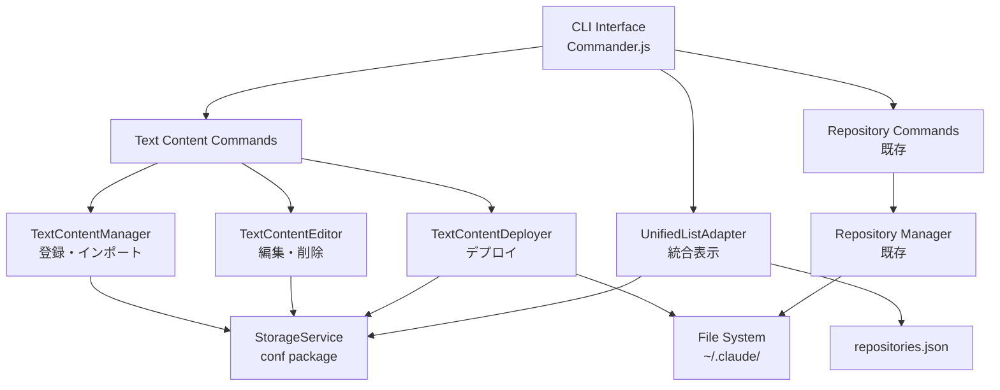
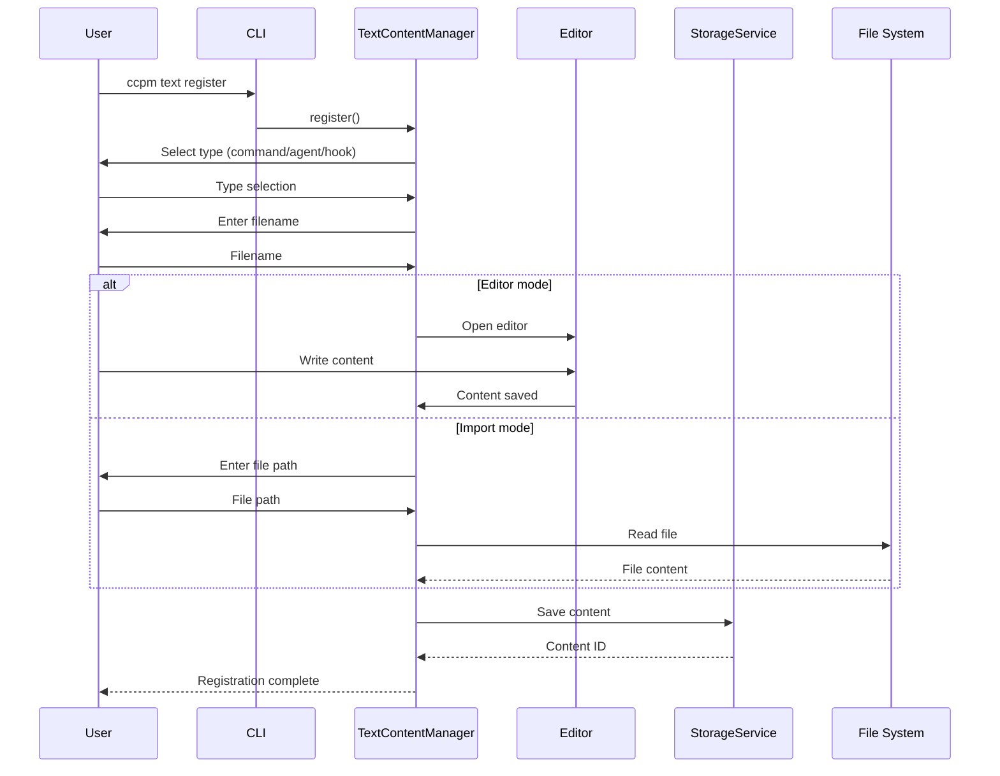
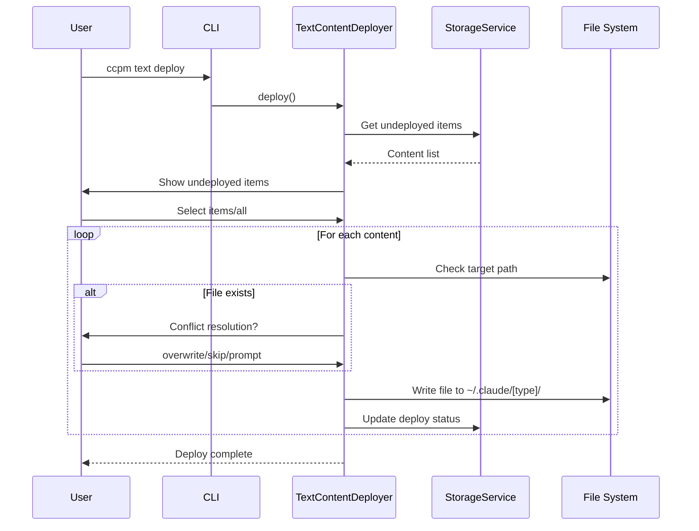
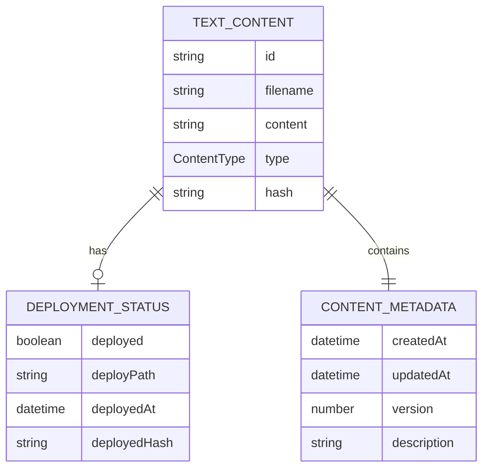

# 技術設計書

## 概要

テキストコンテンツ管理機能は、GitHubリポジトリに依存しない単一ファイルのコマンド、エージェント、フックを直接管理・デプロイできる仕組みを提供します。この設計では、既存のCCPMアーキテクチャを拡張し、ローカルストレージにテキストコンテンツを保存し、`~/.claude/`配下の適切なディレクトリにデプロイする機能を実装します。

## 要件マッピング

### 設計コンポーネントの追跡可能性
各設計コンポーネントが特定の要件に対応しています：
- **TextContentManager** → REQ-1: テキストコンテンツの登録
- **TextContentEditor** → REQ-2: テキストコンテンツの管理
- **TextContentDeployer** → REQ-3: テキストコンテンツのデプロイ
- **UnifiedListAdapter** → REQ-4: リポジトリとテキストコンテンツの統合管理
- **TextExportImportService** → REQ-5&6: エクスポート・インポート機能
- **StorageService** → REQ-7: データ永続性

### ユーザーストーリーのカバレッジ
- ツール作成者のストーリー: TextContentManagerがエディタ起動とファイルインポートを提供
- ツール管理者のストーリー: TextContentEditorが一覧表示・編集・削除機能を実装
- ツール利用者のストーリー: TextContentDeployerがClaude Codeへのデプロイを実現
- パワーユーザーのストーリー: UnifiedListAdapterが統合管理ビューを提供

## アーキテクチャ

### 高レベルシステムアーキテクチャ



### 技術スタック

調査結果と要件分析に基づいて：

- **ストレージ**: [conf](https://www.npmjs.com/package/conf) - JSON Schema検証付きの設定管理
- **データ構造**: TypeScript型定義による厳密な型管理
- **エディタ統合**: child_processでシステムデフォルトエディタを起動
- **ファイル操作**: fs-extra（既存）による安全なファイル操作
- **CLI**: Commander.js（既存）によるコマンド拡張
- **ログ**: Winston（既存）による操作ログ
- **テーブル表示**: cli-table3（既存）による一覧表示

### アーキテクチャ決定の根拠

- **なぜconf**: JSON Schema検証、dot notation対応、TypeScriptサポート、軽量
- **なぜ既存ツールを活用**: 一貫性の維持、学習コストの削減、実装速度
- **なぜTypeScript型定義**: 型安全性、IntelliSense、実行時エラーの防止
- **なぜ統合アダプタパターン**: 既存機能との互換性を保ちつつ拡張可能

## データフロー

### 主要なユーザーフロー

#### 1. テキストコンテンツ登録フロー



#### 2. テキストコンテンツデプロイフロー



## コンポーネントとインターフェース

### バックエンドサービス＆メソッドシグネチャ

#### TextContentManager
```typescript
class TextContentManager {
    constructor(storage: StorageService);
    
    async register(options?: RegisterOptions): Promise<TextContent>;         // 新規登録
    async importFromFile(filePath: string, type: ContentType): Promise<TextContent>; // ファイルインポート
    private openEditor(tempFile: string): Promise<string>;                  // エディタ起動
    private generateId(): string;                                           // ID生成
}
```

#### TextContentEditor
```typescript
class TextContentEditor {
    constructor(storage: StorageService);
    
    async list(filter?: ListFilter): Promise<TextContent[]>;               // 一覧表示
    async edit(id: string): Promise<void>;                                 // 編集
    async delete(id: string): Promise<void>;                               // 削除
    async show(id: string): Promise<TextContent>;                          // 詳細表示
}
```

#### TextContentDeployer
```typescript
class TextContentDeployer {
    constructor(storage: StorageService);
    
    async deploy(ids?: string[], options?: DeployOptions): Promise<DeployResult>; // デプロイ
    async undeploy(ids: string[]): Promise<void>;                         // アンデプロイ
    async getUndeployedItems(): Promise<TextContent[]>;                   // 未デプロイ一覧
    private resolveConflict(path: string, options: ConflictOptions): Promise<ConflictResolution>; // 競合解決
}
```

#### StorageService
```typescript
class StorageService {
    constructor(config: StorageConfig);
    
    async save(content: TextContent): Promise<void>;                       // 保存
    async get(id: string): Promise<TextContent | null>;                   // 取得
    async getAll(): Promise<TextContent[]>;                              // 全件取得
    async update(id: string, updates: Partial<TextContent>): Promise<void>; // 更新
    async delete(id: string): Promise<void>;                              // 削除
    async backup(): Promise<void>;                                        // バックアップ
}
```

### フロントエンドコンポーネント（CLI）

| コンポーネント名 | 責任 | Props/状態の概要 |
|----------------|------|-----------------|
| RegisterCommand | テキストコンテンツ登録コマンド | type選択、filename入力、editor/import選択 |
| ListCommand | 一覧表示コマンド | filter条件、表示形式（table/json） |
| EditCommand | 編集コマンド | content ID、エディタ起動 |
| DeleteCommand | 削除コマンド | content ID、確認プロンプト |
| DeployCommand | デプロイコマンド | ID選択、競合解決オプション |
| ShowCommand | 詳細表示コマンド | content ID、unified表示対応 |

### CLIコマンド

| コマンド | 用途 | オプション | 例 |
|---------|------|-----------|-----|
| `ccpm text register` | テキストコンテンツを登録 | `--type`, `--import` | `ccpm text register --type command` |
| `ccpm text list` | テキストコンテンツ一覧 | `--type`, `--status` | `ccpm text list --type agent` |
| `ccpm text edit <id>` | コンテンツを編集 | なし | `ccpm text edit abc123` |
| `ccpm text delete <id>` | コンテンツを削除 | `--force` | `ccpm text delete abc123` |
| `ccpm text deploy` | コンテンツをデプロイ | `--all`, `--conflict` | `ccpm text deploy --all` |
| `ccpm text export` | エクスポート | `--format`, `--output` | `ccpm text export --format json` |
| `ccpm text import` | インポート | `--file`, `--merge` | `ccpm text import --file backup.json` |
| `ccpm list` | 統合一覧（既存拡張） | `--type` | `ccpm list --type all` |

## データモデル

### ドメインエンティティ
1. **TextContent**: テキストベースのコンテンツ（コマンド、エージェント、フック）
2. **DeploymentStatus**: デプロイメント状態の追跡
3. **ContentMetadata**: コンテンツのメタ情報（作成日時、更新日時など）

### エンティティ関係



### データモデル定義

```typescript
// TypeScript インターフェース
interface TextContent {
  id: string;                      // 一意識別子
  filename: string;                // ファイル名（拡張子なし）
  content: string;                 // テキストコンテンツ本文
  type: ContentType;               // command | agent | hook
  hash: string;                    // コンテンツハッシュ（変更検出用）
  deployment?: DeploymentStatus;   // デプロイメント状態
  metadata: ContentMetadata;       // メタデータ
}

interface DeploymentStatus {
  deployed: boolean;               // デプロイ済みフラグ
  deployPath?: string;             // デプロイ先パス
  deployedAt?: Date;               // デプロイ日時
  deployedHash?: string;           // デプロイ時のハッシュ
}

interface ContentMetadata {
  createdAt: Date;                 // 作成日時
  updatedAt: Date;                 // 更新日時
  version: number;                 // バージョン番号
  description?: string;            // 説明（オプション）
}

enum ContentType {
  COMMAND = 'command',
  AGENT = 'agent',
  HOOK = 'hook'
}
```

### ストレージスキーマ（conf）

```typescript
// JSON Schema for conf validation
const schema = {
  textContents: {
    type: 'object',
    patternProperties: {
      '^[a-zA-Z0-9-]+$': {
        type: 'object',
        properties: {
          id: { type: 'string' },
          filename: { type: 'string' },
          content: { type: 'string' },
          type: { enum: ['command', 'agent', 'hook'] },
          hash: { type: 'string' },
          deployment: {
            type: 'object',
            properties: {
              deployed: { type: 'boolean' },
              deployPath: { type: 'string' },
              deployedAt: { type: 'string', format: 'date-time' },
              deployedHash: { type: 'string' }
            }
          },
          metadata: {
            type: 'object',
            required: ['createdAt', 'updatedAt', 'version'],
            properties: {
              createdAt: { type: 'string', format: 'date-time' },
              updatedAt: { type: 'string', format: 'date-time' },
              version: { type: 'number' },
              description: { type: 'string' }
            }
          }
        },
        required: ['id', 'filename', 'content', 'type', 'hash', 'metadata']
      }
    }
  }
};
```

### マイグレーション戦略
- confのmigration機能を使用してバージョン間の移行を管理
- 初回リリースではマイグレーション不要
- 将来の拡張時にスキーマ変更を追跡
- バックアップ機能により、データ損失リスクを最小化

## エラーハンドリング

### エラー分類と処理

```typescript
// カスタムエラークラス
class TextContentError extends Error {
  constructor(message: string, public code: ErrorCode) {
    super(message);
  }
}

enum ErrorCode {
  // 登録関連
  DUPLICATE_FILENAME = 'DUPLICATE_FILENAME',
  INVALID_CONTENT_TYPE = 'INVALID_CONTENT_TYPE',
  EDITOR_FAILED = 'EDITOR_FAILED',
  
  // 管理関連
  CONTENT_NOT_FOUND = 'CONTENT_NOT_FOUND',
  EDIT_CONFLICT = 'EDIT_CONFLICT',
  
  // デプロイ関連
  DEPLOY_CONFLICT = 'DEPLOY_CONFLICT',
  PERMISSION_DENIED = 'PERMISSION_DENIED',
  
  // ストレージ関連
  STORAGE_ERROR = 'STORAGE_ERROR',
  BACKUP_FAILED = 'BACKUP_FAILED'
}
```

### エラーハンドリング戦略
- ユーザーフレンドリーなエラーメッセージ
- リカバリー提案の提供
- ロールバック機能（デプロイ失敗時）
- 詳細なエラーログ（Winston使用）

## セキュリティ考慮事項

### 入力検証
- ファイル名の検証（パストラバーサル攻撃の防止）
- コンテンツタイプの厳密な検証
- インポートファイルのサイズ制限（DoS攻撃の防止）

### ファイルシステムセキュリティ
- `~/.claude/`配下のみへの書き込み制限
- ファイルパーミッションの適切な設定（実行可能ファイルは755、それ以外は644）
- シンボリックリンクの検証

### データ保護
- ローカルストレージのアクセス権限管理
- バックアップファイルの暗号化オプション（将来機能）
- センシティブ情報のマスキング（ログ出力時）

## パフォーマンスとスケーラビリティ

### パフォーマンス目標
| メトリック | 目標値 | 測定方法 |
|-----------|--------|----------|
| 登録時間 | < 100ms | エディタ起動を除く |
| 一覧表示（1000件） | < 200ms | confからの読み込み |
| デプロイ（10ファイル） | < 500ms | ファイルシステム書き込み |
| 検索（1000件中） | < 50ms | メモリ内フィルタリング |

### キャッシング戦略
- **メモリキャッシュ**: 頻繁にアクセスされるコンテンツリスト
- **ファイルハッシュ**: 変更検出の高速化
- **デプロイ状態**: リアルタイムステータス表示

### スケーラビリティアプローチ
- ページネーション実装（大量コンテンツ対応）
- インデックス機能（高速検索）
- 非同期処理（大量デプロイ時）
- ストレージ分割（タイプ別ファイル）

## テスト戦略

### テストカバレッジ要件
- **ユニットテスト**: ≥85% コードカバレッジ
- **統合テスト**: 全CLIコマンドとストレージ操作
- **E2Eテスト**: 主要ユーザーフロー
- **パフォーマンステスト**: 1000件のコンテンツでの動作確認

### テストアプローチ

#### 1. ユニットテスト
```typescript
// 例：TextContentManagerのテスト
describe('TextContentManager', () => {
  it('should register new content with editor', async () => {
    // エディタのモック
    // ストレージのモック
    // 登録処理のテスト
  });
});
```

#### 2. 統合テスト
- CLIコマンドの実行テスト
- ストレージとファイルシステムの統合動作
- 既存機能との互換性テスト

#### 3. E2Eテスト
- 登録→編集→デプロイの完全フロー
- インポート/エクスポート機能
- 競合解決シナリオ

### CI/CDパイプライン

